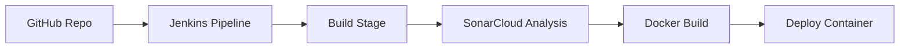

# 🚀 CI/CD Pipeline on AWS using Jenkins, SonarCloud & Docker

## 📌 Project Overview

This project demonstrates a complete **CI/CD pipeline** built on AWS using Jenkins. The pipeline automates code integration, quality analysis, containerization, and deployment.

It showcases real-world DevOps practices including:

* Continuous Integration (CI)
* Continuous Deployment (CD)
* Code Quality Analysis
* Container-based Deployment

---

## 🛠️ Tech Stack

* ☁️ AWS EC2 (RHEL 9)
* 🔧 Jenkins
* 🐙 GitHub
* 🔍 SonarCloud
* 🐳 Docker
* 💻 Node.js Application

---

## 🔄 CI/CD Pipeline Flow



---

## ⚙️ Pipeline Stages

### 1️⃣ Clone

* Pulls source code from GitHub repository

### 2️⃣ Build

* Basic build validation

### 3️⃣ SonarCloud Analysis

* Performs static code analysis
* Checks code quality and security

### 4️⃣ Docker Build

* Builds Docker image from application

### 5️⃣ Deploy

* Runs container on EC2 instance
* Exposes app on port `3000`

---

## 🧪 Project Structure

```
├── app.js
├── package.json
├── Dockerfile
└── Jenkinsfile
```

---

## 🚀 How to Run This Project

### Step 1: Clone Repository

```
git clone https://github.com/shabinshareefa5018/cicd-rhel-jenkins-project.git
```

### Step 2: Setup Jenkins

* Install Jenkins on EC2
* Configure credentials (GitHub + SonarCloud)

### Step 3: Run Pipeline

* Create Jenkins pipeline job
* Add Jenkinsfile
* Click **Build Now**

---

## 🌐 Application Access

After deployment:

```
http://<EC2-PUBLIC-IP>:3000
```

---

## 🔍 Key Challenges & Solutions

### 🔐 SSH Authentication Issue

* Fixed by configuring Jenkins credentials correctly

### ⚠️ SonarCloud Integration Errors

* Resolved using proper token and project setup

### 💥 Memory Issues (Node.js crash)

* Solved by increasing swap memory on EC2

### 🔄 Jenkins Credential Scope Issue

* Fixed by using Global credentials properly

---

## 📈 Key Learnings

* Hands-on experience with CI/CD pipelines
* Debugging real-world DevOps issues
* Managing cloud infrastructure constraints
* Secure credential handling in Jenkins

---

## 🏁 Conclusion

This project demonstrates a production-like CI/CD pipeline setup and highlights the importance of automation, monitoring, and debugging in DevOps workflows.

---

## 🙌 Author

**Shabin Shareefa**

* 💼 Aspiring DevOps Engineer
* 🌍 Based in India
* 🔗 GitHub: https://github.com/shabinshareefa5018

---
